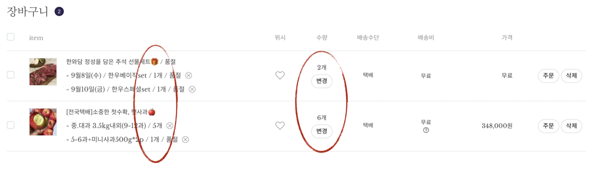

# MANNAMCHU

MANNAMCHU-backend는 Wecode 부트캠프 24기 프로젝트 중 하나로, 
e-commerce 마담주 사이트를 클론한 백엔드 API 입니다. 
2주의 기간 동안 프론트엔드 개발자 3명, 백엔드 개발자 2명이 팀을 이루어
각 기능별로 Agile 방법론을 적용하여 개발했습니다.

커머스 사이트의 가장 기본이라고 생각하는 
회원가입, 로그인, 전체상품 리스트, 상세페이지, 장바구니 기능을 구현했습니다.

프론트엔드 개발 현황은 
[24-1st-MANNAMCHU-frontend](https://github.com/wecode-bootcamp-korea/24-1st-MANNAMCHU-frontend) 
여기서 확인하실 수 있습니다.

## 구현기능
* 회원가입, 로그인 : Bcrypt로 비밀번호 암호화, JWT Authorization 구현
* 전체 상품 리스트 : pagination을 적용하여 상품 24개씩 노출, 가장 최근에 등록한 상품부터 노출, 태그 필터링
* 상세 페이지 : 상품 관련 정보 모두 호출 구현
* 장바구니 : 상품 담기, 수량 수정

## 개선사항
기존 사이트에는 장바구니에서 한 상품에 여러 가지 옵션이 부여되어있는 경우가 많았습니다.
같은 상품이긴 하지만 구성이 완전히 다를 수도 있는 옵션이 작게 노출되고, 
수량은 통합되어 보여지는 것이 직관적이지 않을 수도 있겠다는 생각이 들었습니다.

장바구니에 상품의 id를 넣는 방법 대신 옵션 id를 직접 넣어, 
옵션을 각각 하나의 개별 상품처럼 보이도록 하는 방법을 선택했습니다.
프론트엔드 개발자분들과 협의하여 옵션마다 개별 row를 가지고 표현되도록 개발했습니다.

## 적용기술
* API : Python, Django Web framework
* 보안 : Bcrypt, JWT
* DB : Mysql
* 배포 : AWS - EC2, RDS, S3 (현재는 닫아둔 상태입니다)

### Reference
* 이 프로젝트는 [마담주](https://madamjooapp.imweb.me) 사이트를 참조하여 학습목적으로 만들었습니다.
* 실무수준의 프로젝트이지만 학습용으로 만들었기 때문에 이 코드를 활용하여 이득을 취하거나 무단 배포할 경우 법적으로 문제될 수 있습니다.
* 이 프로젝트에서 사용하고 있는 사진 대부분은 위코드에서 구매한 것이므로 해당 프로젝트 외부인이 사용할 수 없습니다.
